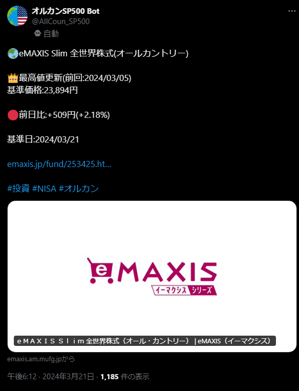
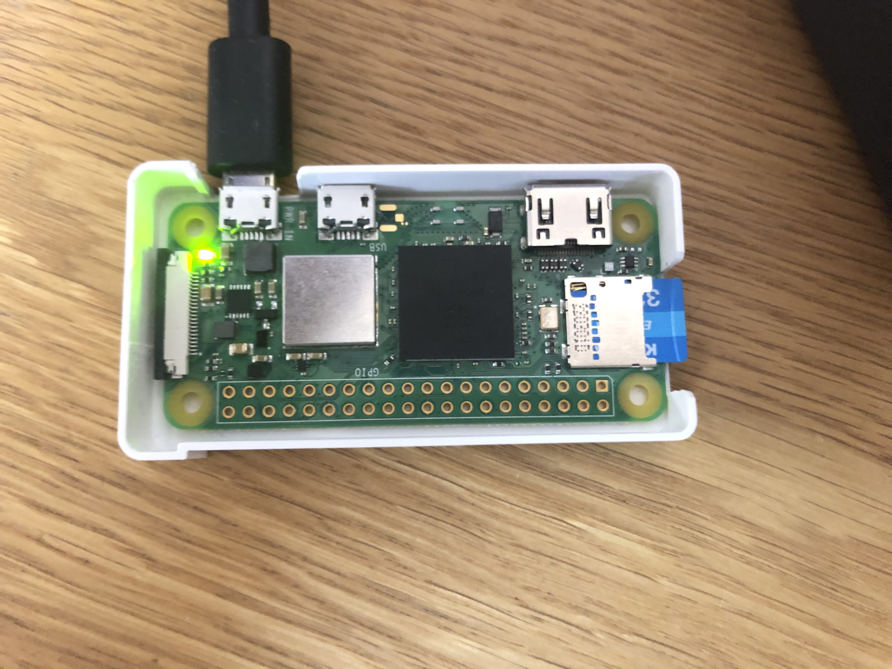
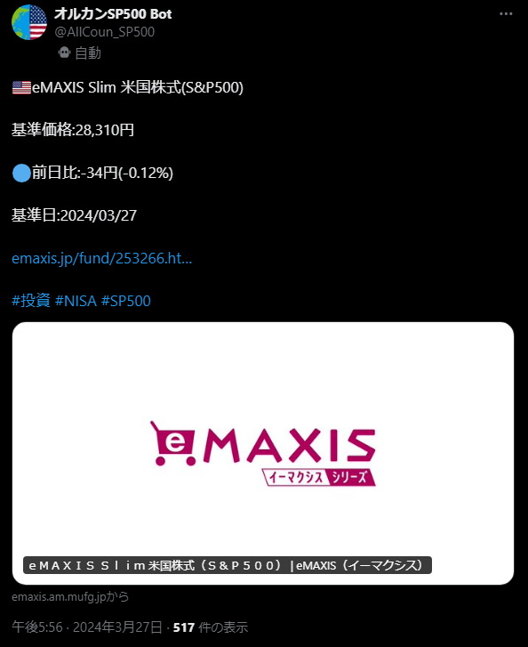
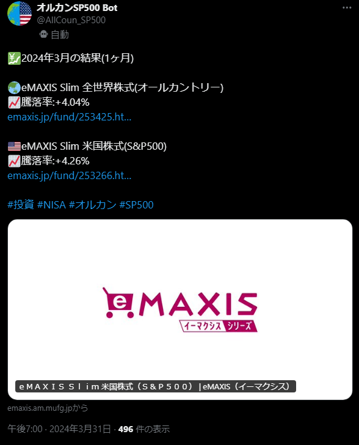

# オルカンSP500 Bot

三菱UFJアセットマネジメント社 が運用する eMAXIS Slim 全世界株式(オールカントリー) とeMAXIS Slim 米国株式(S&P500) の値動きを X に投稿するBotです。

[eMAXIS Slim 全世界株式(オールカントリー)](https://emaxis.jp/fund/253425.html)

[eMAXIS Slim 米国株式(S&P500)](https://emaxis.jp/fund/253266.html)

## X アカウント

https://x.com/AllCoun_SP500

## 仕様技術
- Raspberry Pi Zero 2 W
    - cron
- Python 3.12.1
- JSON

RaspberryPiでPythonファイルを定期実行させています。

## 機能

| 全世界株式 | 米国株式 |
| ---- | ---- |
|  |  |
| 全世界株式の値動きの投稿します。 | 米国株式の値動きの投稿します。 |

- 前日比がプラスの場合は赤丸、マイナスの場合は青丸の絵文字を表示します。
- 最高値更新時には前回更新日を表示させます。

| 月の結果 |
| ---- |
|  |
| 月末に両ファンドの1ヶ月の騰落率を投稿します。 |
